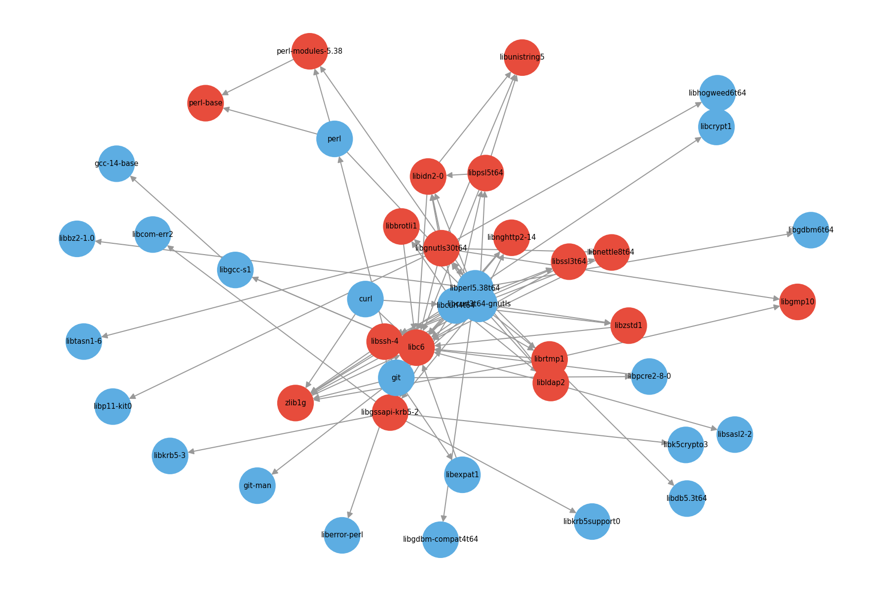

# Analyseur de dépendances de paquets Linux

Outil en Python qui analyse les paquets installés sur un système Linux
(Debian/Ubuntu), construit un graphe de leurs dépendances, identifie
les paquets essentiels vs optionnels, et génère une visualisation.



## Prérequis

- Un système Linux basé sur Debian/Ubuntu (utilise `dpkg` et `apt-cache`)
- Python 3.8+

## Installation

```bash
pip install networkx matplotlib
```

## Utilisation

Modifier la liste `ROOT_PACKAGES` en bas du fichier `pkg_analyzer.py`
avec les paquets que tu veux analyser, puis lancer :

```bash
python3 pkg_analyzer.py
```

Cela génère :
- `dependencies.json` : le graphe exporté en JSON (nœuds, arêtes,
  paquets essentiels/optionnels)
- `dependencies.png` : la visualisation graphique de l'arborescence
- Un résumé texte dans le terminal

## Comment ça marche

1. **`list_installed_packages()`** — liste tous les paquets installés
   via `dpkg-query`.
2. **`get_dependencies(package_name)`** — récupère les dépendances
   directes d'un paquet via `apt-cache depends`.
3. **`build_dependency_graph()`** — explore récursivement les
   dépendances à partir de paquets "racines", jusqu'à une profondeur
   maximale (pour éviter d'explorer tout le système d'un coup).
4. **`classify_packages()`** — un paquet est "essentiel" si beaucoup
   d'autres paquets dépendent de lui (in-degree élevé) ; "optionnel"
   s'il n'a aucune dépendance entrante dans le graphe étudié.
5. **`export_to_json()`** — sauvegarde le résultat pour réutilisation.
6. **`visualize_graph()`** — dessine le graphe avec les paquets
   essentiels en rouge.

## Pistes d'amélioration (pour la suite)

- Étendre l'exploration à tout le système plutôt qu'à quelques paquets
  racines (attention aux performances)
- Ajouter un mode "simulation" : que se passe-t-il si je supprime
  tel paquet ? (parcourir les prédécesseurs dans le graphe)
- Distinguer les dépendances obligatoires (Depends) des recommandées
  (Recommends) et suggérées (Suggests)
- Croiser avec une base de vulnérabilités connues (ex. CVE) pour
  prioriser la veille de sécurité sur les paquets les plus utilisés
- Interface graphique interactive (au lieu d'une image statique) avec
  une librairie comme `pyvis` ou `plotly`
